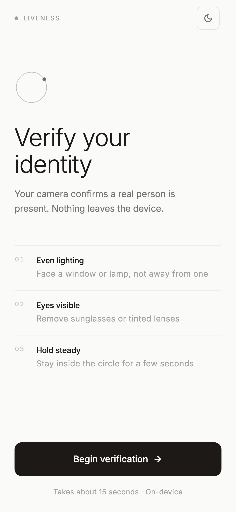
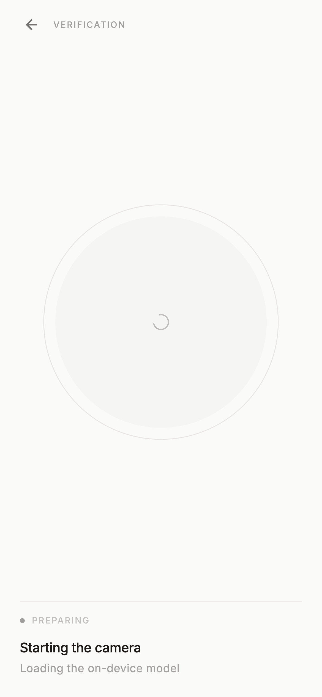
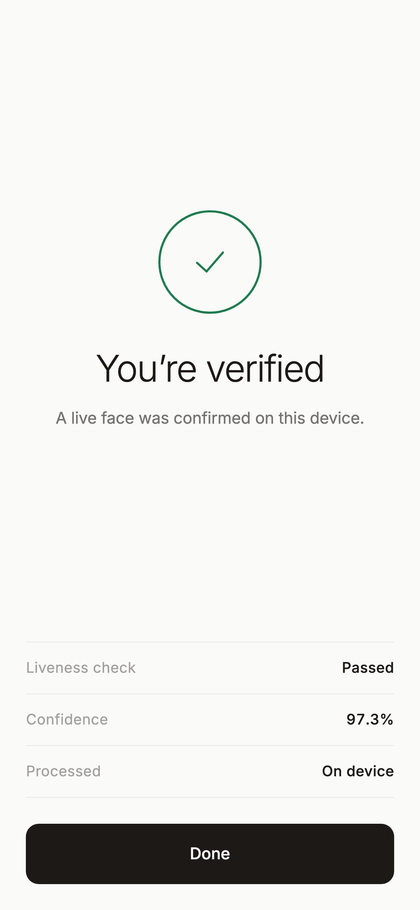
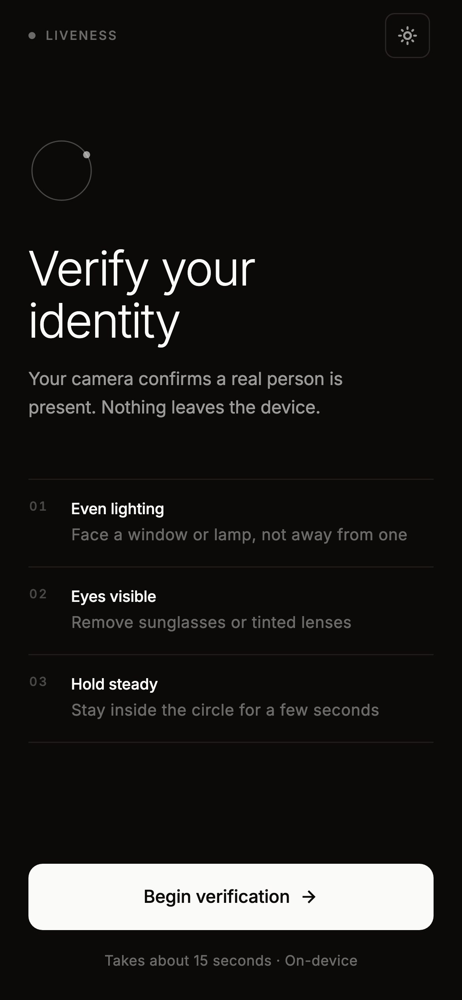
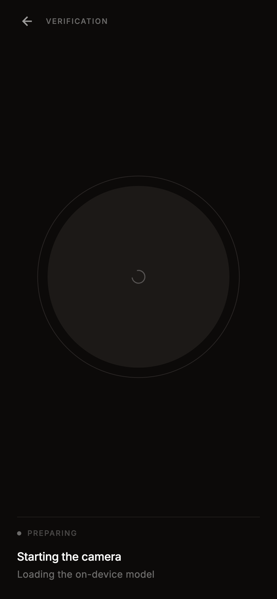
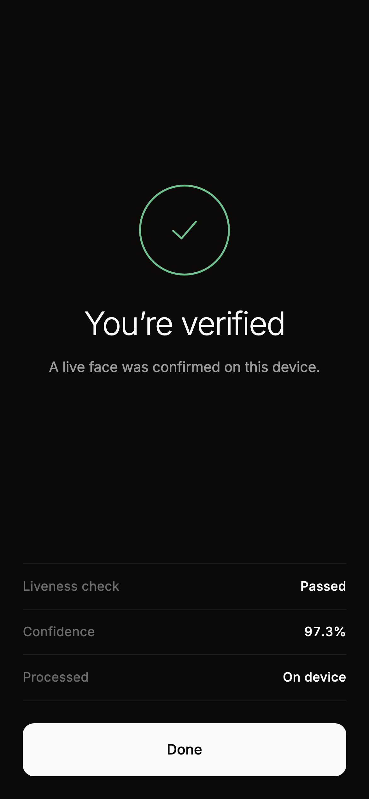

# 🔬 Face Liveness Detection — Flutter Demo

## 📥 Download APK

[Download APK](https://github.com/azraihan/liveliness-detection/releases/download/v1.0.0/app-release.apk)

> To build the APK yourself: `flutter build apk --release`

---

A face liveness detection app built in Flutter. It records a short clip from the
front camera and runs a MobileNetV3 temporal model **on the device** to decide
whether it is looking at a live face or a spoof — no frames leave the phone.

The interface is deliberately quiet: a neutral stone palette, one accent (ink on
paper), hierarchy carried by opacity rather than colour, and motion used only
where it indicates state. Light and dark are both first-class.

---

## 🖼 Screens

Light and dark follow the system setting, with a toggle on the landing screen.

**Light**

| Landing | Verification | Verified |
|:--:|:--:|:--:|
|  |  |  |

**Dark**

| Landing | Verification | Verified |
|:--:|:--:|:--:|
|  |  |  |

> The verification screen is shown in its `PREPARING` state — the capture
> harness has no camera, so the preview is a placeholder.

Regenerate every screenshot after a UI change:

```bash
flutter test tool/screenshots_test.dart --update-goldens
```

That harness lives outside `test/` on purpose: `flutter test` would otherwise
compare the PNGs as goldens, and they render slightly differently per machine.

---

## 📱 App Flow

| Page | Description |
|------|-------------|
| **Landing** | Wordmark, instruction index, and a single ink call to action → tap to start |
| **Liveness** | Circular camera preview inside a hairline ring; the ring fills as the 24-frame clip is collected, and a band of radial ticks breathes around it while capturing |
| **Success** | The ring closes in green, then the checkmark draws itself, over a receipt of what was checked |

---

## ⚙️ Prerequisites

Make sure these are installed on your machine:

| Tool | Version | Link |
|------|---------|------|
| Flutter SDK | ≥ 3.0.0 | https://docs.flutter.dev/get-started/install |
| Dart | ≥ 3.0.0 | Included with Flutter |
| Android Studio / Xcode | Latest | For emulators / device builds |
| A real device (recommended) | iOS or Android | Camera won't work on most emulators |

Verify your setup:
```bash
flutter doctor
```

---

## 🚀 Quick Start

### 1. Clone the repository

```bash
git clone https://github.com/YOUR_USERNAME/face_liveness_demo.git
cd face_liveness_demo
```

### 2. Install dependencies

```bash
flutter pub get
```

### 3. Connect your phone

Enable **Developer Mode** on your device:

- **Android**: Settings → About Phone → tap Build Number 7 times → enable USB Debugging
- **iOS**: Connect via Xcode once, trust the computer on device

Verify device is detected:
```bash
flutter devices
```

### 4. Run the app

```bash
flutter run
```

For a specific device:
```bash
flutter run -d <device_id>
```

---

## 📱 Platform Setup

### Android

Add camera permission to `android/app/src/main/AndroidManifest.xml` inside `<manifest>`:

```xml
<uses-permission android:name="android.permission.CAMERA" />
```

Also ensure `minSdk` is at least **21** in `android/app/build.gradle.kts`:

```kotlin
android {
    defaultConfig {
        minSdk = 21
        // or use the Flutter default:
        // minSdk = flutter.minSdkVersion
    }
}
```

> **Note:** Recent Flutter versions (3.19+) already default to minSdk 21 via `flutter.minSdkVersion`.

---

### iOS

Add the camera permission description to `ios/Runner/Info.plist` inside `<dict>`:

```xml
<key>NSCameraUsageDescription</key>
<string>Face Liveness needs your camera to verify your identity.</string>
```

Then open Xcode, select your Team under **Signing & Capabilities**, and trust your developer certificate on the device.

---

## 🐙 Push to GitHub

### First time setup

```bash
# Initialize git (if not done)
git init
git add .
git commit -m "Initial commit: Face Liveness Demo"

# Create a new repo on github.com, then:
git remote add origin https://github.com/YOUR_USERNAME/face_liveness_demo.git
git branch -M main
git push -u origin main
```

### Subsequent pushes

```bash
git add .
git commit -m "Your commit message"
git push
```

---

## 📁 Project Structure

```
lib/
├── main.dart                      # Entry point; wires light/dark themes, warms the model
├── theme/
│   ├── app_theme.dart             # AppPalette tokens, type scale, spacing, motion constants
│   └── theme_controller.dart      # ThemeMode holder + InheritedNotifier scope
├── services/
│   └── liveness_model.dart        # Process-wide TorchScript module, loaded once
├── painters/
│   └── scan_ring_painter.dart     # Progress ring, capture ticks, scan sweep, orbit mark, checkmark
├── widgets/
│   ├── animated_label.dart        # Per-character reveal + state-label swap
│   ├── app_button.dart            # The app's only button (solid / quiet)
│   ├── fade_rise.dart             # Staggered entrance primitive
│   └── theme_toggle.dart          # Light ↔ dark control
└── pages/
    ├── landing_page.dart          # Instructions + start
    ├── liveness_page.dart         # Camera, clip collection, inference, status
    └── success_page.dart          # Verified result + receipt

assets/fonts/                      # Inter (300/400/500/600)
docs/screens/                      # Screenshots above
tool/screenshots_test.dart         # Screenshot harness (not part of the test suite)
```

---

## 🧪 Model Experiments

This repository also includes the liveness/deepfake model experiment folders:

| Folder | What it contains |
|--------|------------------|
| `mnetv2-anti-spoof-baseline/` | A single-frame MobileNetV2 anti-spoofing baseline with webcam inference, a trained `.pt` checkpoint, memory profiling, and mobile conversion notes. |
| `spatio-temporal-mnetv3/` | A MobileNetV3 temporal-average-pooling pipeline for Celeb-DF v2, including training, K=24 inference, PyTorch Lite export, and Flutter handover files. |
| `g2v2former/` | Server-side G2V2Former model — the second stage of the pipeline. Includes notebooks for training, latency benchmarking, and a FastAPI serving endpoint, plus the trained weights (see folder README). |
| `gd-fas/` | GD-FAS (ICCV 2025, CLIP ViT-B/16) run as an external comparison baseline under the exact same datasets, metrics, and two-experiment protocol as G2V2Former. Includes the offline-bundle prep notebook, the experiments notebook, and the recorded HTER/AUC results. |

### MobileNetV2 baseline

Use this folder when you want the simpler webcam-based baseline:

```bash
cd mnetv2-anti-spoof-baseline
pip install -r requirements.txt
python mobilenetv2-inference.py
```

For a folder-level file map and step-by-step usage, read:

```text
mnetv2-anti-spoof-baseline/README.md
```

### Spatio-temporal MobileNetV3

Use this folder for the temporal Celeb-DF v2 model and the current K=24 mobile artifact:

```bash
cd spatio-temporal-mnetv3
pip install -r requirement.txt
python infer_mobilenetv3_celebdfv2_kaggle.py
```

The folder also includes:

```text
spatio-temporal-mnetv3/README.md
spatio-temporal-mnetv3/FLUTTER_PTL_HANDOVER.md
spatio-temporal-mnetv3/mobilenetv3_temporal_k24.ptl
spatio-temporal-mnetv3/model_contract.json
```

For mobile integration, keep `mobilenetv3_temporal_k24.ptl` and `model_contract.json` together and follow the preprocessing and aggregation rules in `FLUTTER_PTL_HANDOVER.md`.

### G2V2Former (server-side stage)

Use this folder for the second-stage server model. Frames flagged as suspicious by the on-device model are sent here for a more robust deepfake / spoof check.

```bash
cd g2v2former
# Open the notebooks in this order:
#   1. g2v2former-train.ipynb       -> trains the model and saves a checkpoint
#   2. g2v2former-latency.ipynb     -> benchmarks inference latency
#   3. g2v2former-server.ipynb      -> serves the model behind a FastAPI endpoint
```

The folder also includes the trained weights (hosted on Google Drive — see the link in `g2v2former/README.md`) and a qualitative sample:

```text
g2v2former/README.md
g2v2former/sample_predictions.png
```

Download the trained weights, place them alongside the notebooks (or update the load path inside them), then point the Flutter app's second-stage call at the FastAPI server URL.

### GD-FAS (comparison baseline)

Use this folder to reproduce the GD-FAS numbers we compare G2V2Former against. It is a two-notebook Kaggle workflow: the first notebook (internet on) packs the CLIP checkpoint, the GD-FAS repo, and the two missing pip wheels into an offline bundle; the second notebook (GPU, internet off) attaches that bundle plus the datasets and runs both experiments.

```bash
cd gd-fas
# Open the notebooks in this order:
#   1. gd-fas-prepare-offline-bundle.ipynb -> builds gdfas_offline_bundle.zip (upload as a Kaggle dataset)
#   2. gd-fas-experiments.ipynb            -> Exp 1 (train LCC-FASD) + Exp 2 (finetune Celeb-DF-v2), HTER/AUC on all sets
```

Recorded results, charts, and the list of deviations from the official GD-FAS defaults are in:

```text
gd-fas/README.md
gd-fas/results/gdfas_experiment_comparison.csv
gd-fas/results/gdfas_hter_comparison.png
gd-fas/results/gdfas_auc_comparison.png
```

---

## 🎨 Design System

Every colour lives in `AppPalette` (`lib/theme/app_theme.dart`) as a semantic
token with a light and a dark value. Nothing in the UI names a hex code.

| Token | Light | Dark | Usage |
|-------|-------|------|-------|
| `background` | `#FAFAF9` | `#0C0A09` | Page |
| `surface` | `#FFFFFF` | `#16130F` | Raised surfaces |
| `surfaceMuted` | `#F5F5F4` | `#1C1917` | Insets, placeholders |
| `border` | `#E7E5E4` | `#292524` | Hairlines, ring track |
| `ink` | `#1C1917` | `#FAFAF9` | Text, and the app's only accent |
| `success` | `#1F7A4D` | `#6FC28F` | Verified |
| `danger` | `#B42318` | `#E8857B` | Not confirmed |

Two rules do most of the work:

- **Hierarchy is opacity over `ink`, never a second hue** — `textPrimary` (100%),
  `textSecondary` (60%), `textTertiary` (40%), `textGhost` (26%). The same four
  steps in both modes.
- **One accent, and it is ink itself.** `success` and `danger` are reserved for
  the verdict and appear nowhere else.

Type is Inter, bundled as an asset. Display sizes are *light* (300) with tight
tracking; nothing exceeds 600. Spacing is an 8px scale (`Space`), radii and
motion durations are likewise tokens (`Radii`, `Motion`).

---

## 🔧 Customisation

**Decision threshold** — in `liveness_page.dart`:
```dart
static const double _liveThreshold = 0.8;   // required P(real) to pass a clip
```
Raising it trades false accepts for false rejects. The decision is per clip,
with no agreement required across clips.

**Clip length** — `_clipFrames` in `liveness_page.dart` must match the exported
model (`model_contract.json`); changing it alone will break inference.

**Motion** — durations and curves are centralised in `Motion`
(`lib/theme/app_theme.dart`). Screen-specific loops worth knowing:
- `_tickPhaseCtrl` — how fast the capture ticks travel around the ring
- `_holdMs` in `animated_label.dart` — how long the wordmark rests between cycles

**Theme** — edit the `AppPalette.light` / `AppPalette.dark` constants; every
screen follows.

All ambient motion is gated on `prefers-reduced-motion` via `reducedMotion()`.

---

## 📦 Dependencies

```yaml
camera: ^0.10.5+9           # Live camera preview / frame stream
flutter_pytorch_lite: ^0.1.0+3  # On-device TorchScript inference
http: ^1.2.0                # Reserved for the server-side second stage
```

---

## 🛠 Troubleshooting

| Problem | Fix |
|---------|-----|
| Camera shows placeholder | Make sure you granted camera permission and are on a real device |
| `flutter doctor` shows missing tools | Follow the links it provides to install missing items |
| iOS build fails with signing error | In Xcode → Signing & Capabilities → set a valid team |
| Android: `minSdkVersion` error | Set `minSdkVersion 21` in `android/app/build.gradle` |
| Pub get fails | Run `flutter clean && flutter pub get` |

---

## 📄 License

MIT — free to use for personal or commercial projects.
