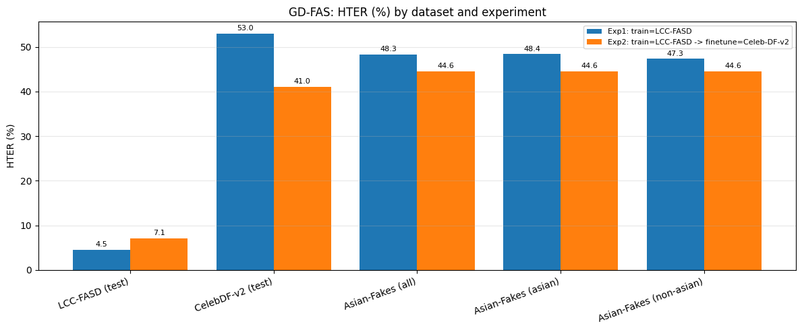
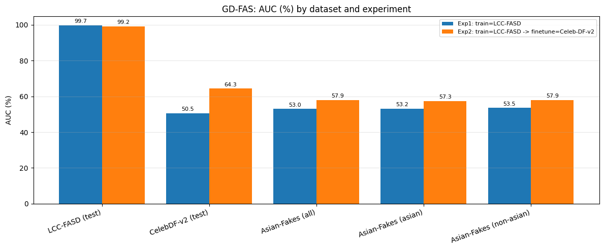

# GD-FAS — External Comparison Baseline

This directory runs **GD-FAS** ("Group-wise Scaling and Orthogonal Decomposition for Domain-Invariant Feature Extraction in Face Anti-Spoofing", ICCV 2025, official implementation, CLIP ViT-B/16 backbone) on the **same three datasets, metrics, and two-experiment protocol** as our G2V2Former model in `../g2v2former/`. It exists so the two models' HTER / AUC numbers line up side by side.

- Official repo: https://github.com/SeungjinJung/GD-FAS
- Nothing from that repo is copied here — it is cloned into an offline bundle at run time (see below).

## Contents

| File | Purpose |
|------|---------|
| `gd-fas-prepare-offline-bundle.ipynb` | Run **first**, in an internet-enabled Kaggle notebook (CPU is fine). Downloads the `ftfy` / `regex` wheels, the OpenAI CLIP `ViT-B-16.pt` checkpoint (~350 MB), clones the GD-FAS repo, and zips everything into `gdfas_offline_bundle.zip`. |
| `gd-fas-experiments.ipynb` | Run **second**, in an offline (no-internet) GPU Kaggle notebook with the bundle attached as a dataset. Mounts the bundle, indexes the three datasets straight from `/kaggle/input`, runs Experiment 1 and Experiment 2, and writes the results table + charts. The notebook is a single cell; each logical step is marked `# %% CELL n` and can be split into separate cells if preferred. |
| `results/gdfas_experiment_comparison.csv` | Final HTER / AUC per dataset per experiment, scored from the saved best checkpoints. |
| `results/gdfas_hter_comparison.png` | Grouped bar chart, HTER by dataset and experiment. |
| `results/gdfas_auc_comparison.png` | Grouped bar chart, AUC by dataset and experiment. |

## Experiment protocol (identical to G2V2Former)

| Experiment | Train | Test |
|------------|-------|------|
| **Exp 1** | LCC-FASD (train split) | LCC-FASD test, Celeb-DF-v2 official test protocol, Asian-Fakes (all / asian / non-asian) |
| **Exp 2** | Exp 1 best checkpoint → finetune on a Celeb-DF-v2 train split disjoint from the official test list | same five eval sets |

- Metrics: **HTER at EER** and **AUC**, computed with the GD-FAS repo's own `utils.eval`, reported in %.
- Celeb-DF-v2 subsets and caps match the G2V2Former runs: 100 eval videos (stratified from the official protocol list), 300 train videos (stratified from everything *not* in the protocol), 16 frames sampled per video.
- Best checkpoint is tracked on LCC-FASD test (Exp 1) and on Celeb-DF-v2 test (Exp 2); the final numbers are scored off those saved checkpoints.

## Datasets / Kaggle inputs

Attach these to the offline experiments notebook via **Add Data**:

| Input | Source | Path variable to edit |
|-------|--------|-----------------------|
| Offline bundle | output of `gd-fas-prepare-offline-bundle.ipynb`, uploaded as a private Kaggle dataset (zip or extracted folder both work) | `GDFAS_BUNDLE_SRC` |
| LCC-FASD | https://www.kaggle.com/datasets/faber24/lcc-fasd | `LCC_INPUT_ROOT` |
| Celeb-DF-v2 | https://www.kaggle.com/datasets/reubensuju/celeb-df-v2 | `CELEBDF_INPUT_ROOT` |
| Asian-Fakes stills | `raihanzahin/prep-sbi-extra` notebook output (`sbi_faces_extra/images`) | `ASIAN_FAKES_ROOT` |
| *(optional)* G2V2Former cache | `celebdf_index.pt` / `celebdf_train_index.pt` from the G2V2Former runs. Reusing them gives both models the exact same Celeb-DF videos **and** face-crop boxes. | `CELEBDF_CACHE_SEED_DIR` |

Every `EDIT` comment in the notebook marks a path that depends on how Kaggle mounted your inputs.

## How to run

1. Open `gd-fas-prepare-offline-bundle.ipynb` in a Kaggle notebook **with internet on**, run it, and download / publish `/kaggle/working/gdfas_offline_bundle.zip` as a private Kaggle dataset.
2. Open `gd-fas-experiments.ipynb` in a Kaggle notebook with a **GPU** and internet **off**. Attach the bundle dataset plus the three data inputs above.
3. Update the `EDIT` paths at the top of the notebook, then run top to bottom.
4. Outputs land in `/kaggle/working/ckpts/`: `gdfas_lcc_best.pt`, `gdfas_lcc_then_celebdf_best.pt`, `gdfas_experiment_comparison.csv`, and the two PNG charts.

Only `ftfy` and `regex` are installed (from local wheels). Torch, torchvision, scikit-learn, OpenCV, and PIL come from Kaggle's image. Do **not** install the GD-FAS repo's pinned `requirements.txt`; the old versions conflict with Kaggle's stack.

## Deviations from the official GD-FAS defaults

Read these before comparing against the paper's numbers.

1. **Datasets.** The repo's O/C/I/M protocol datasets are not used. LCC-FASD, Celeb-DF-v2, and Asian-Fakes are fed through adapter `Dataset` classes that read directly from `/kaggle/input`, producing the same dict shape as the repo's own datasets.
2. **Single training domain.** The repo trains on three source domains. With one domain, the group-scaling slope `alpha = log(num_domain)/2` is zero, so `num_domain` is clamped to 2 and a `1e-8` epsilon is added to the group-loss std. Batch size is raised from 16 to 48 so that images-per-step (192) matches the repo's 3-domain setting the learning rate was tuned for.
3. **Eval frame.** The repo scores one random frame per test video; here the middle frame is used for reproducibility.
4. **Eval cadence.** Evaluation runs every 40 iterations (Exp 1) / 20 iterations (Exp 2) instead of every 10.
5. **Celeb-DF-v2 face crops.** Landmark boxes from the G2V2Former cache are reused when that cache is attached. In the recorded run no cache was attached and `face_alignment` was not importable, so the **center-crop fallback** was used (Celeb-DF is centered talking-head footage). The notebook prints which path ran.

Everything else (CLIP ViT-B/16 backbone, text prompt templates, losses, group-wise scaling + Gram-Schmidt decomposition, Adam lr 3e-6, weight decay 1e-6, StepLR gamma 0.1) is the repo's. Exp 2 uses 200 iterations at lr 1e-6 to limit forgetting of LCC-FASD.

## Results (recorded run)

Run on Kaggle, torch 2.10.0 + CUDA 12.8, NVIDIA RTX PRO 6000 Blackwell. Numbers are from the saved best checkpoints; see `results/gdfas_experiment_comparison.csv`.

| Dataset | Exp 1 HTER (%) | Exp 1 AUC (%) | Exp 2 HTER (%) | Exp 2 AUC (%) |
|---------|---------------:|--------------:|---------------:|--------------:|
| LCC-FASD (test) | 4.55 | 99.69 | 7.07 | 99.16 |
| CelebDF-v2 (test) | 52.99 | 50.49 | 41.04 | 64.35 |
| Asian-Fakes (all) | 48.33 | 52.98 | 44.58 | 57.94 |
| Asian-Fakes (asian) | 48.40 | 53.18 | 44.59 | 57.29 |
| Asian-Fakes (non-asian) | 47.32 | 53.54 | 44.57 | 57.88 |

**Reading the numbers.** GD-FAS is strong in-domain on LCC-FASD (presentation attacks) but sits at chance on the two deepfake datasets when trained on LCC-FASD alone. Finetuning on Celeb-DF-v2 lifts CelebDF AUC from ~50% to ~64% and gives a small transfer gain on Asian-Fakes, at the cost of a few HTER points on LCC-FASD. Compare against the G2V2Former table in `../g2v2former/` for the same protocol.
